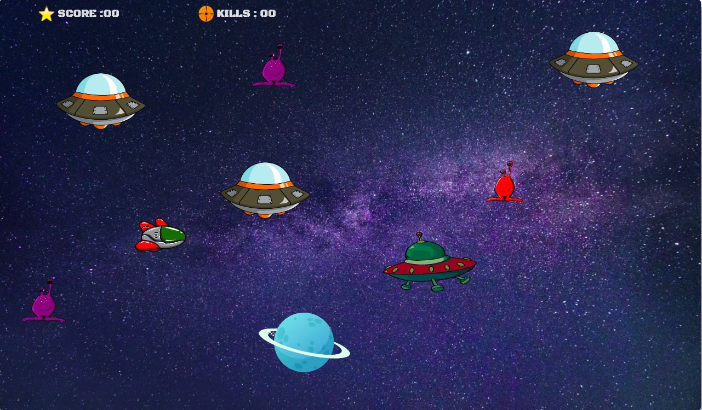
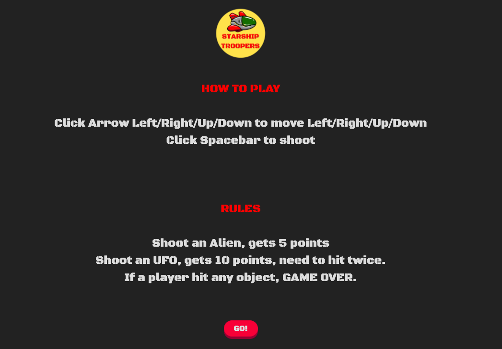

[Starship-Troopers-Backend-Here](https://github.com/Tanattha/starship-troopers-backend)

# Starship-Troopers-Frontend

You'll be in a role of starship troopers to kill all the enemies. Starship-troopers was built with JavaScript on the frontend and Rails on the backend.



## Live App

[CLICK HERE](https://tanattha.github.io/starship-troopers-frontend)

## Video Walkthrough

[CLICK HERE](https://youtu.be/MRv4XRmLPM4)


## How to play



## Installation

```
clone this repo
cd starship-troopers-frontend
open index.html
```

## License

The gem is available as open source under the terms of the [MIT License](https://opensource.org/licenses/MIT).


## Speical Thanks

https://www.clipartmax.com/<br />
https://www.remove.bg/upload<br />
https://www.zapsplat.com/<br />
https://www.pexels.com/<br />
https://favicon.io/<br />
[Font: Black Ops One Designed by James Grieshaber](https://fonts.google.com/specimen/Black+Ops+One#standard-styles)

and everything else from google!

